# A Products Management System.
A comprehensive product management system built with Laravel, showcasing REST API implementation, user authentication, role-based access control, and CRUD operations.

## Introduction
This project aims to provide a user-friendly and feature-rich product management system. It includes functionalities for adding, editing, and deleting products, managing roles, and handling staff users. The system is built with Laravel, mysql database and bootstrap backend ensuring a robust and scalable solution.

## Installation
Clone the repository.
import the database included in the parent folder
Configure your environment variables.
## Usage
Run the application: php artisan serve.
Access the system at http://localhost:8000.

## Sample Pages

## Dashboard Page
Dashboard page showing products and staff count
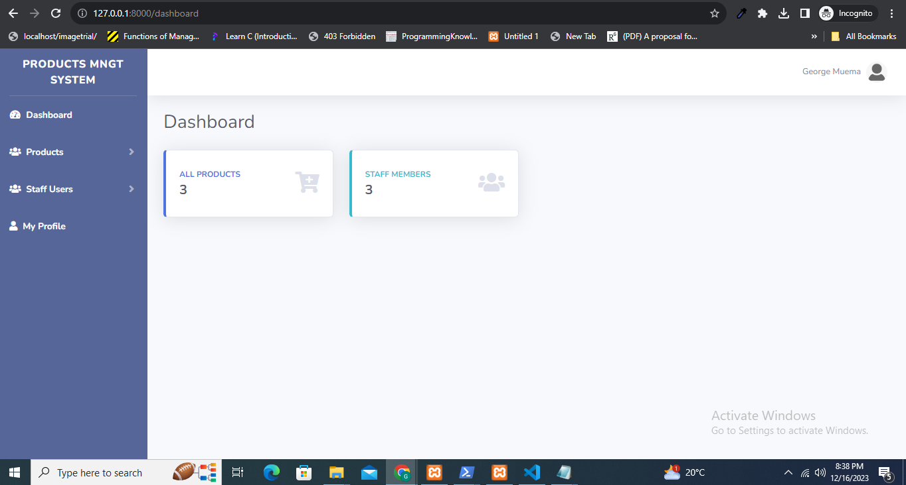

## Add Products Page
A form for adding new products
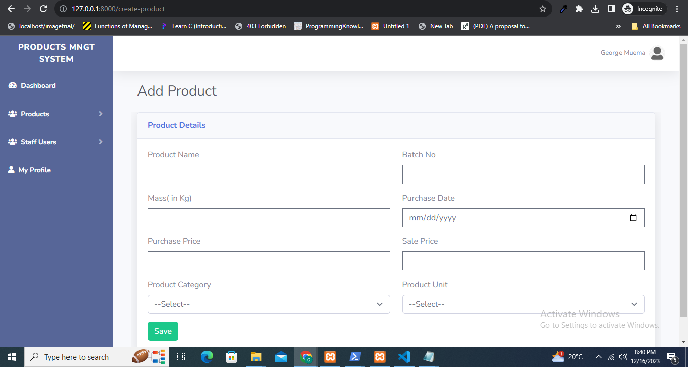

## Validation Rules in JS 
A sample javascript validation message showing that product name cannot be null
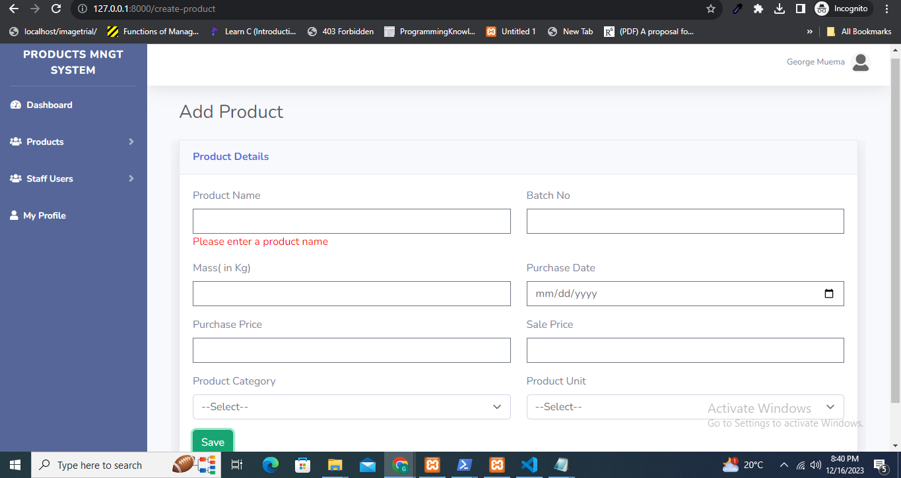

## Products Page
A products management page with edit and delete options
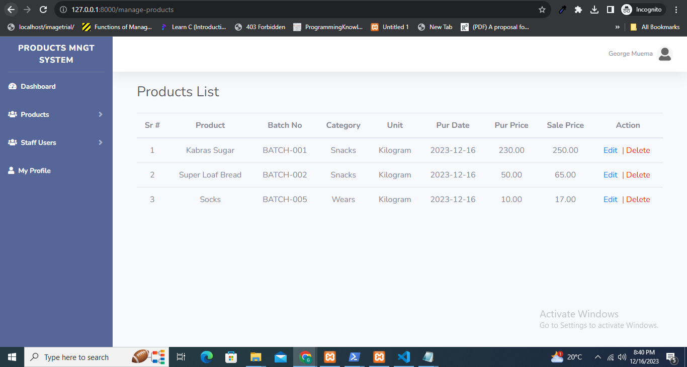

## Edit Products Page
A form for editing product details
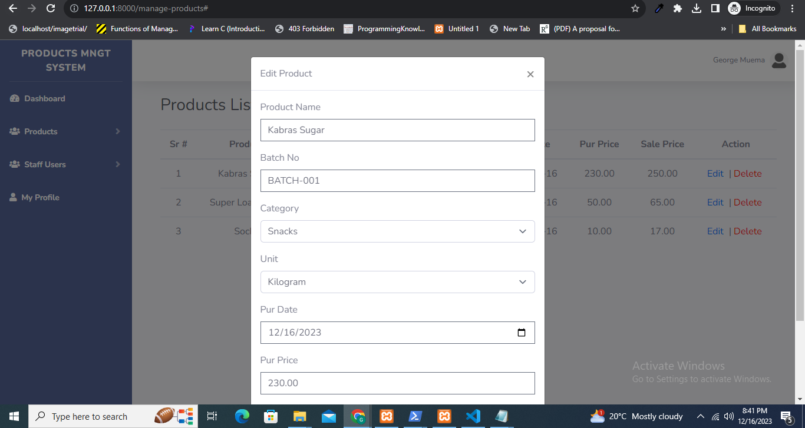

## A Product delete confirmation Page
A product delete confirmation message
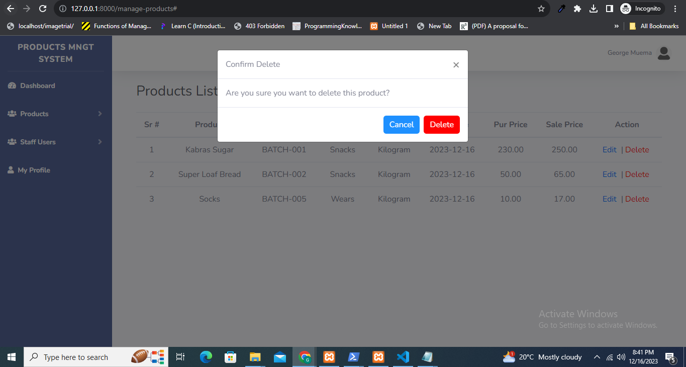

## Roles and Permission Page
Roles and permissions page 
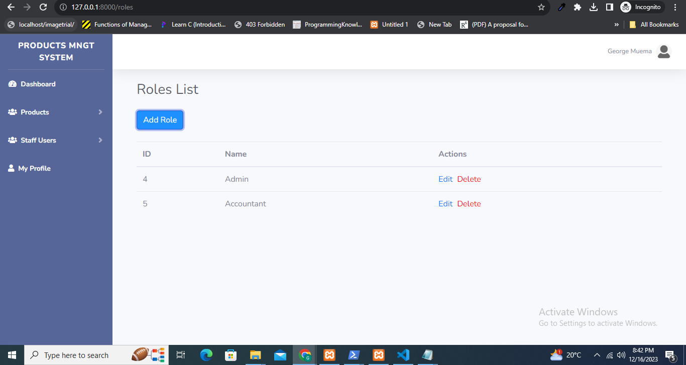

## Add Roles Page
A form for adding Roles and assigning permissions
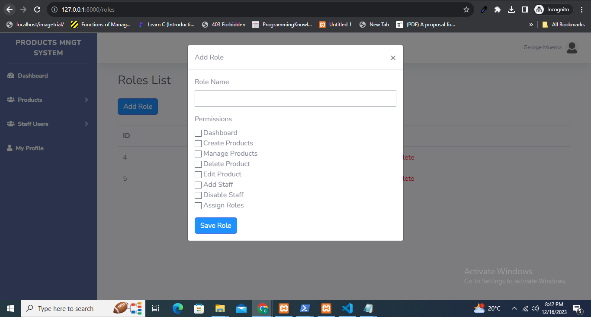

## Editing Roles
Form for Editing roles and permissions
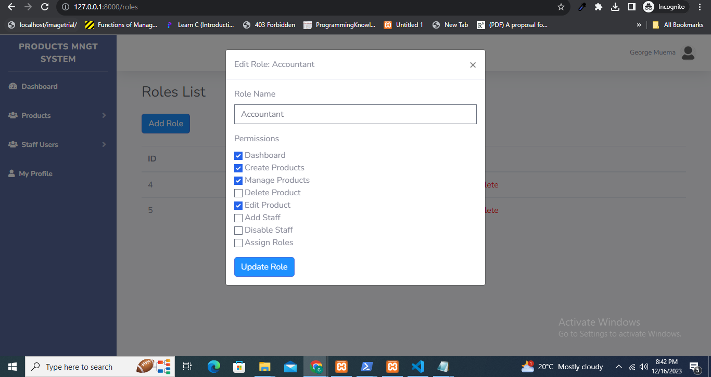

## Manage Staff
Staff management page
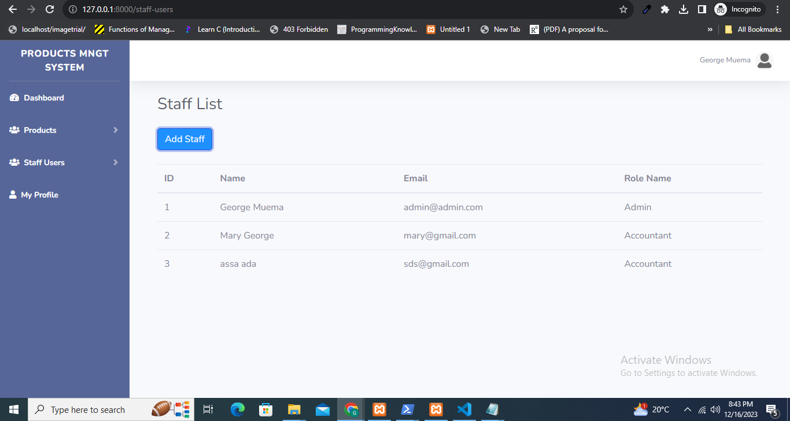

## Add new Staff
A form for adding a new staff
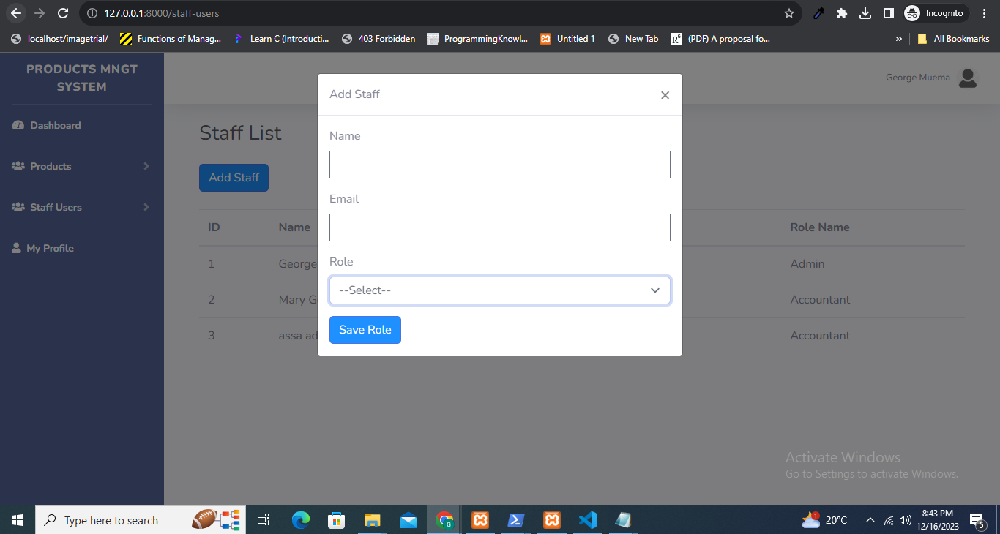
## Logout
logout form

