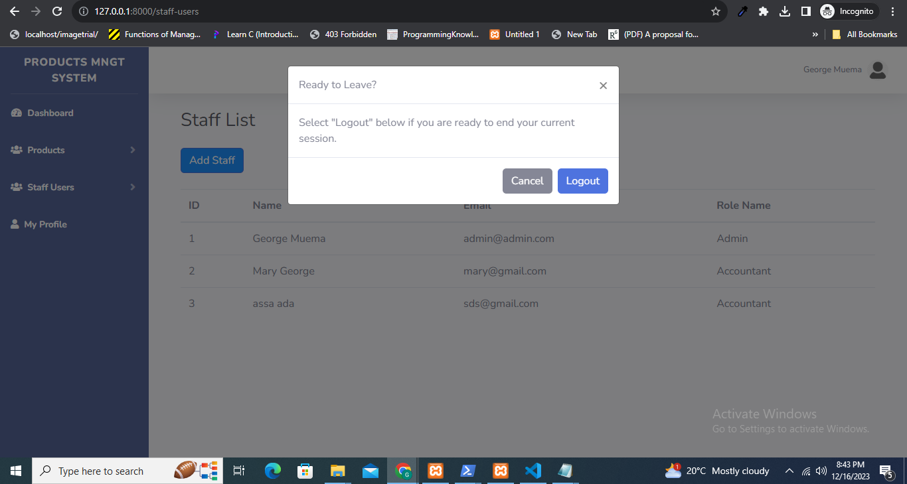

# A simple products management system in Laravel project to show case use of REST API,Authentication and CRUD Operations.

## Dashboard Page
Dashboard showing products and staff count

## Add Products Page
A form for adding a new products

## Validation Rules in JS 
A message showing that product name cannot be null

## Products Page
A products management page with edit and delete

## Edit Products Page
An edit product form

## A Product delete confirmation Page
A delete confirmation message

## A Product delete confirmation Page
A delete confirmation message

## Roles Page
Roles page

## Add Roles Page
Add Roles page

## Edit Roles Page
Edit roles 

## Manage Staff
manage staff

## Add new Staff
add staff

## Logout
logout form

